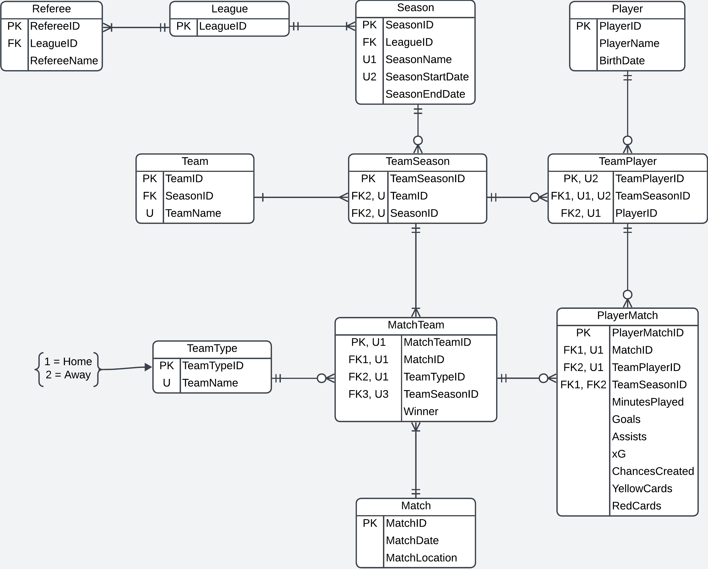
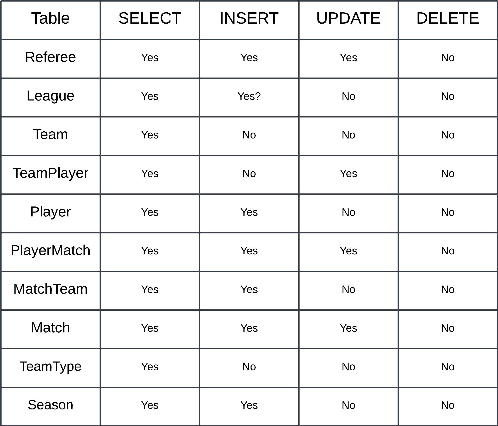

# Project Concept
Initial idea is sort of like fantasy football, but for soccer. Users will be able to see stats from three different leagues. These stats will include individual player stats, match stats, referee stats, etc. The primary function (not a fantasy football) would  be to find stats for the various leagues with some visuals to show when players and teams are doing good or bad. 

To be able to run the project you must do a couple of things. The first is to set up a virtual environment (see below) and run the the command

## Back-end
cd into \backend\app

From here create a virtual environment, in this example we will call it `venv` with the following command.

python -m venv venv

To run the venv we activate it as follows

venv\Scripts\activate

Finally run the `requirements.txt` file as follows

pip install -r requirements.txt

### Create the .env file
Add a new text file and call it `.env`, add the following lines.

- DB_SERVER=(localdb)\MSSQLLocalDb
- DB_NAME=CIS560
- JWT_SECRET_KEY=PutWhateverYouWantHere

Finally, run the `app.py`

app.py is the script that will start the program we will run in the virtual environment (venv). Again from here be sure you have the virtual enviroment active
## Front-End
Frontend was done using ReactJS. To be able to run the program you first must install all the dependencies by going into the frontend directory and running the command

cd into `\frontend`
then do the following comand 
`npm install`

## Loading Data
The final part of this, is to load the data. 
You will need to have a virtual environment (venv).
To do this you will you use the command (if you are on windows)

cd .\database\
python -m venv venv

To run your venv (if you are on windows)

venv\Scripts\activate

Finally run the `requirements.txt` file as follows

pip install -r requirements.txt

Finally run the `bulk_copy.py`, to copy the things into the sql set up.

### Create another .env file
You will also want to create another .env file in this directory and have the following 2 variables:

1. DB_SERVER=(localdb)\MSSQLLocalDb
2. DB_NAME=CIS560

After you have that set up, you need to do this before starting the program and that is run the sql_setup.bat files which will create the tables then read in our data through a python script. 

This will finally allow you to use the data in the website thus allowing you to use our application. 

